# 𝐀𝐥𝐠𝐨𝐫𝐢𝐭𝐡𝐦𝐢𝐚

## 𝙿𝚛𝚘𝚓𝚎𝚌𝚝 𝙳𝚎𝚜𝚌𝚛𝚒𝚙𝚝𝚒𝚘𝚗

𝙰𝚕𝚐𝚘𝚛𝚒𝚝𝚑𝚖𝚒𝚊 𝚒𝚜 𝚊 𝚐𝚛𝚘𝚞𝚙 𝚙𝚛𝚘𝚓𝚎𝚌𝚝 𝚍𝚎𝚟𝚎𝚕𝚘𝚙𝚎𝚍 𝚊𝚜 𝚊 𝚛𝚎𝚚𝚞𝚒𝚛𝚎𝚖𝚎𝚗𝚝 𝚏𝚘𝚛 𝙿𝚛𝚘𝚏𝚎𝚜𝚜𝚘𝚛 𝙼𝚊𝚛𝚢 𝙹𝚊𝚗𝚎 𝙻𝚒𝚖𝚊'𝚜 𝚌𝚘𝚞𝚛𝚜𝚎, <strong>𝙳𝚎𝚜𝚒𝚐𝚗 𝚊𝚗𝚍 𝙰𝚗𝚊𝚕𝚢𝚜𝚒𝚜 𝚘𝚏 𝙰𝚕𝚐𝚘𝚛𝚒𝚝𝚑𝚖𝚜</strong>. 𝚃𝚑𝚎 𝚜𝚊𝚒𝚍 𝚖𝚘𝚋𝚒𝚕𝚎 𝚊𝚙𝚙𝚕𝚒𝚌𝚊𝚝𝚒𝚘𝚗 𝚏𝚘𝚌𝚞𝚜𝚎𝚜 𝚘𝚗 𝚙𝚛𝚘𝚟𝚒𝚍𝚒𝚗𝚐 𝚊 𝚞𝚜𝚎𝚛-𝚏𝚛𝚒𝚎𝚗𝚍𝚕𝚢 𝚒𝚗𝚝𝚎𝚛𝚏𝚊𝚌𝚎 𝚏𝚘𝚛 𝚎𝚡𝚙𝚕𝚘𝚛𝚒𝚗𝚐 𝚟𝚊𝚛𝚒𝚘𝚞𝚜 𝚊𝚕𝚐𝚘𝚛𝚒𝚝𝚑𝚖𝚜, 𝚒𝚗𝚌𝚕𝚞𝚍𝚒𝚗𝚐 <strong>𝙺𝚗𝚊𝚙𝚜𝚊𝚌𝚔</strong>, <strong>𝚂𝚎𝚕𝚎𝚌𝚝𝚒𝚘𝚗 𝚂𝚘𝚛𝚝𝚒𝚗𝚐</strong>, <strong>𝚃𝚂𝙿 (𝚃𝚛𝚊𝚟𝚎𝚕𝚒𝚗𝚐 𝚂𝚊𝚕𝚎𝚜𝚖𝚊𝚗 𝙿𝚛𝚘𝚋𝚕𝚎𝚖)</strong>, 𝚊𝚗𝚍 <strong>𝚂𝚝𝚛𝚒𝚗𝚐 𝙼𝚊𝚝c𝚑𝚒𝚗𝚐</strong>. 𝚄𝚜𝚒𝚗𝚐 𝚊 𝚏𝚛𝚘𝚗𝚝-𝚎𝚗𝚍 𝚏𝚛𝚊𝚖𝚎𝚠𝚘𝚛𝚔 𝚌𝚊𝚕𝚕𝚎𝚍 <strong>𝚁𝚎𝚊𝚌𝚝-𝙽𝚊𝚝𝚒𝚟𝚎</strong> 𝚝𝚘 𝚋𝚞𝚒𝚕𝚍 𝚝𝚑𝚎 𝚄𝙸 𝚊𝚗𝚍 𝚒𝚝𝚜 𝚏𝚞𝚗𝚌𝚝𝚒𝚘𝚗𝚊𝚕𝚒𝚝𝚒𝚎𝚜, 𝚊𝚗𝚍 𝚊 𝙱𝚊𝚊𝚂 (𝙱𝚊𝚌𝚔𝚎𝚗𝚍-𝚊𝚜-𝚊-𝚂𝚎𝚛𝚟𝚒𝚌𝚎) 𝚌𝚊𝚕𝚕𝚎𝚍 <strong>𝙵𝚒𝚛𝚎𝚋𝚊𝚜𝚎</strong> 𝚝𝚘 𝚑𝚊𝚗𝚍𝚕𝚎 𝚝𝚑𝚎 𝚋𝚊𝚌𝚔𝚎𝚗𝚍 𝚏𝚞𝚗𝚌𝚝𝚒𝚘𝚗𝚊𝚕𝚒𝚝𝚒𝚎𝚜 𝚜𝚞𝚌𝚑 𝚊𝚜 𝚜𝚝𝚘𝚛𝚒𝚗𝚐 𝚞𝚜𝚎𝚛 𝚍𝚊𝚝𝚊 𝚊𝚗𝚍 𝚖𝚊𝚗𝚢 𝚖𝚘𝚛𝚎.

𝚈𝚘𝚞 𝚌𝚊𝚗 𝚍𝚘𝚠𝚗𝚕𝚘𝚊𝚍 𝚝𝚑𝚎 mobile 𝚊𝚙𝚙 𝚏𝚛𝚘𝚖 <a href="https://expo.dev/artifacts/eas/5FcNTSMM88cU14Xgm7QZrJ.apk" target="_blank"><strong>𝚝𝚑𝚒𝚜 𝚕𝚒𝚗𝚔</strong></a>.

𝚄𝚙𝚘𝚗 𝚕𝚊𝚞𝚗𝚌𝚑𝚒𝚗𝚐 𝚝𝚑𝚎 𝚊𝚙𝚙𝚕𝚒𝚌𝚊𝚝𝚒𝚘𝚗, 𝚝𝚑𝚎 𝚞𝚜𝚎𝚛 𝚠𝚒𝚕𝚕 𝚋𝚎 𝚐𝚛𝚎𝚎𝚝𝚎𝚍 𝚠𝚒𝚝𝚑 𝚊 𝚕𝚊𝚗𝚍𝚒𝚗𝚐 𝚙𝚊𝚐𝚎 𝚝𝚑𝚊𝚝 𝚜𝚑𝚘𝚠𝚜 𝚝𝚑𝚎 𝚝𝚒𝚝𝚕𝚎 𝚊𝚗𝚍 𝚊 𝚋𝚛𝚒𝚎𝚏 𝚍𝚎𝚜𝚌𝚛𝚒𝚙𝚝𝚒𝚘𝚗 𝚘𝚏 𝚠𝚑𝚊𝚝 𝚝𝚑𝚎 𝚊𝚙𝚙𝚕𝚒𝚌𝚊𝚝𝚒𝚘𝚗 𝚒𝚜 𝚊𝚗𝚍 𝚒𝚝𝚜 𝚙𝚞𝚛𝚙𝚘𝚜𝚎.

  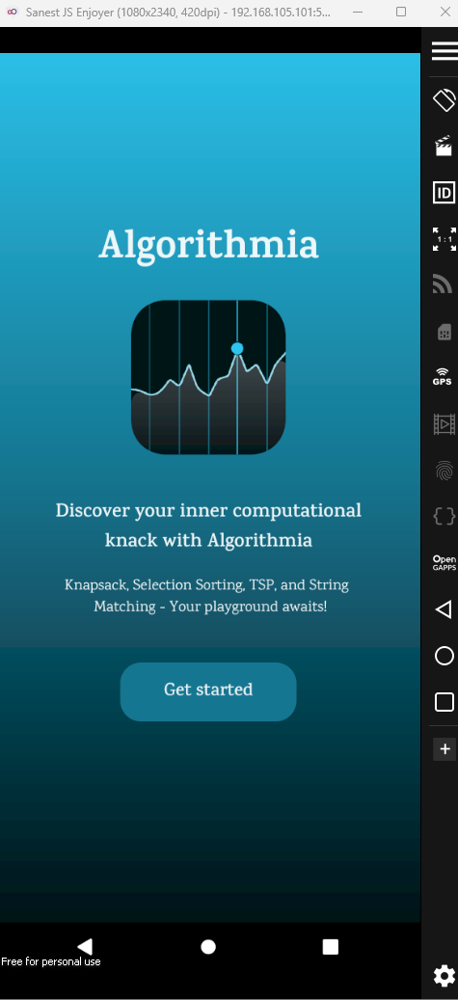

𝙰𝚏𝚝𝚎𝚛 𝚝𝚑𝚊𝚝, 𝚝𝚑𝚎 𝚞𝚜𝚎𝚛 𝚠𝚒𝚕𝚕 𝚋𝚎 𝚙𝚛𝚘𝚖𝚙𝚝 𝚜𝚒𝚐𝚗 𝚒𝚗 𝚘𝚛 𝚜𝚒𝚐𝚗 𝚞𝚙, 𝚍𝚎𝚙𝚎𝚗𝚍𝚒𝚗𝚐 𝚘𝚗 𝚝𝚑𝚎 𝚊𝚟𝚊𝚒𝚕𝚊𝚋𝚒𝚕𝚒𝚝𝚢 𝚘𝚏 𝚝𝚑𝚎 𝚞𝚜𝚎𝚛'𝚜 𝚊𝚌𝚌𝚘𝚞𝚗𝚝.

  

𝚃𝚑𝚎𝚗𝚊𝚏𝚝𝚎𝚛, 𝚝𝚑𝚎 𝚖𝚊𝚒𝚗 𝚖𝚎𝚗𝚞 𝚜𝚌𝚛𝚎𝚎𝚗 𝚠𝚒𝚕𝚕 𝚜𝚑𝚘𝚠 𝚞𝚙, 𝚐𝚒𝚟𝚒𝚗𝚐 𝚝𝚑𝚎 𝚞𝚜𝚎𝚛 𝚝𝚑𝚎 𝚌𝚑𝚘𝚒𝚌𝚎 𝚝𝚘 𝚜𝚎𝚕𝚎𝚌𝚝 𝚊𝚗 𝚘𝚙𝚎𝚛𝚊𝚝𝚒𝚘𝚗.

  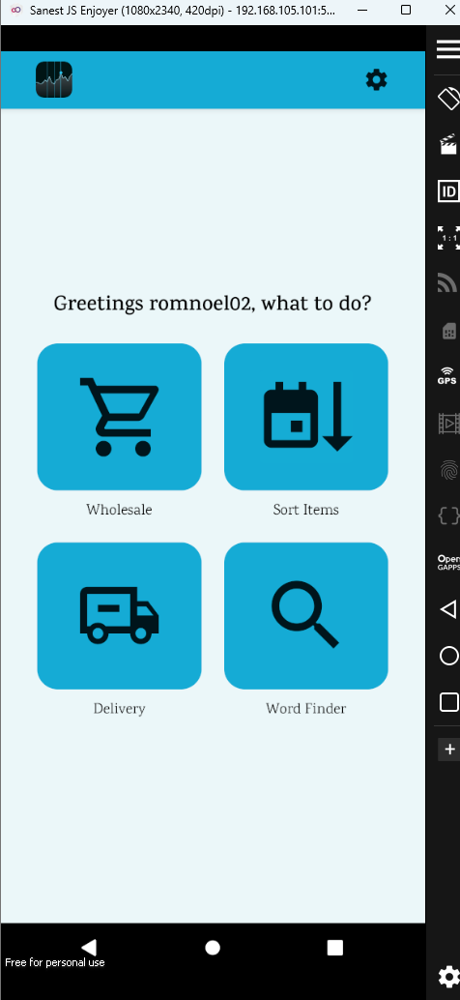

𝚄𝚙𝚘𝚗 𝚜𝚎𝚕𝚎𝚌𝚝𝚒𝚗𝚐 𝚝𝚑𝚎 𝚆𝚑𝚘𝚕𝚎𝚜𝚊𝚕𝚎 𝚘𝚙𝚝𝚒𝚘𝚗, 𝚝𝚑𝚎 𝚞𝚜𝚎𝚛 𝚠𝚒𝚕𝚕 𝚋𝚎 𝚙𝚛𝚎𝚜𝚎𝚗𝚝𝚎𝚍 𝚘𝚏 𝚊 𝚜𝚌𝚛𝚎𝚎𝚗 𝚠𝚒𝚝𝚑 𝚊 𝚏𝚕𝚘𝚊𝚝𝚒𝚗𝚐 𝚋𝚞𝚝𝚝𝚘𝚗 𝚊𝚝 𝚝𝚑𝚎 𝚋𝚘𝚝𝚝𝚘𝚖 𝚛𝚒𝚐𝚑𝚝 𝚝𝚑𝚊𝚝 𝚌𝚊𝚗 𝚋𝚎 𝚞𝚜𝚎𝚍 𝚝𝚘 𝚊𝚍𝚍 𝚙𝚛𝚘𝚍𝚞𝚌𝚝𝚜, 𝚍𝚎𝚕𝚎𝚝𝚎 𝚊𝚕𝚕 𝚙𝚛𝚘𝚍𝚞𝚌𝚝𝚜, 𝚊𝚗𝚍 𝚌𝚊𝚕𝚌𝚞𝚕𝚊𝚝𝚎 𝚝𝚑𝚎 𝚔𝚗𝚊𝚙𝚜𝚊𝚌𝚔 𝚘𝚏 𝚝𝚑𝚎 𝚜𝚊𝚒𝚍 𝚒𝚝𝚎𝚖𝚜.

  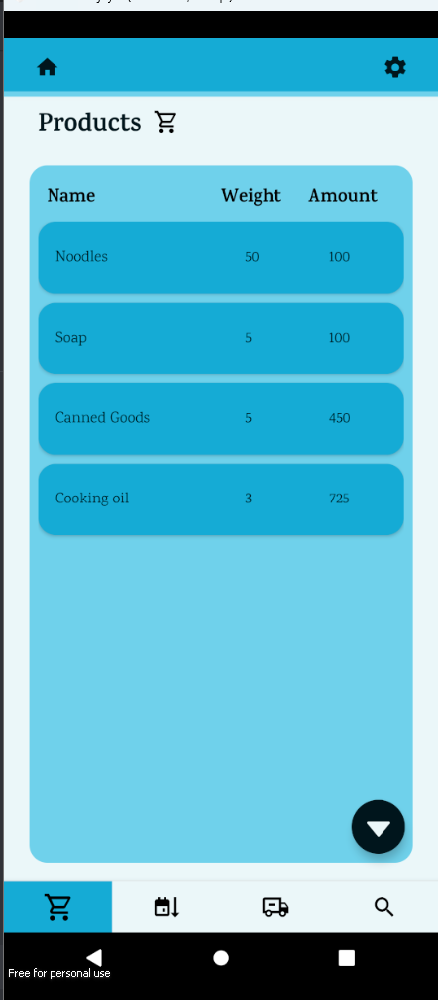
  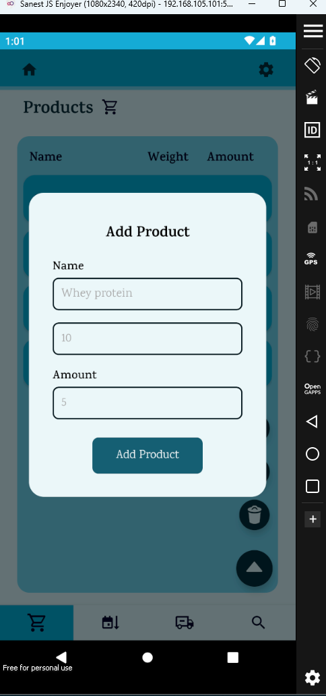
  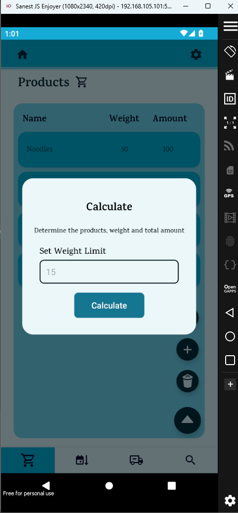

𝙾𝚗 𝚝𝚑𝚎 𝚎𝚟𝚎𝚗𝚝 𝚘𝚏 𝚝𝚑𝚎 𝚋𝚞𝚝𝚝𝚘𝚗 𝚙𝚛𝚎𝚜𝚜 𝙲𝚊𝚕𝚌𝚞𝚕𝚊𝚝𝚎, 𝚝𝚑𝚎 𝚞𝚜𝚎𝚛 𝚠𝚒𝚕𝚕 𝚋𝚎 𝚜𝚑𝚘𝚠𝚎𝚍 𝚝𝚑𝚎 𝚔𝚗𝚊𝚙𝚜𝚊𝚌𝚔 𝚒𝚗𝚏𝚘𝚛𝚖𝚊𝚝𝚒𝚘𝚗 𝚘𝚏 𝚝𝚑𝚎 𝚙𝚛𝚘𝚍𝚞𝚌𝚝𝚜.

  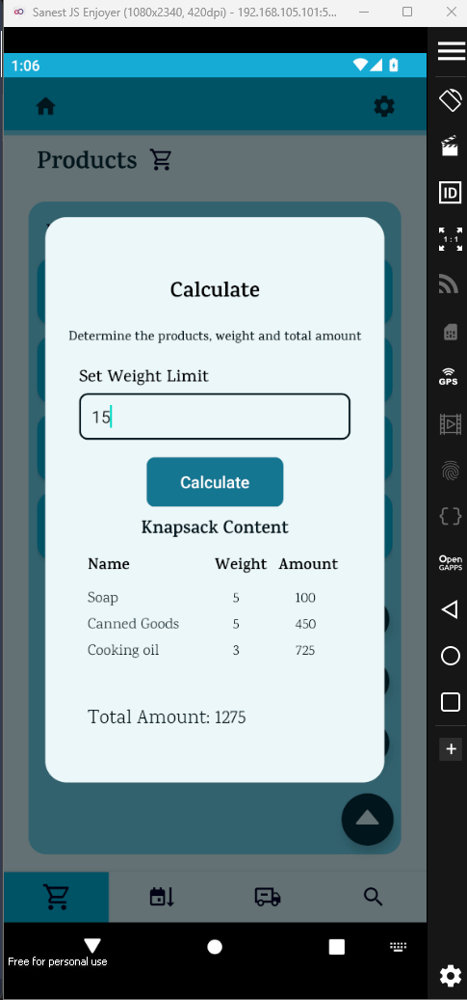

𝙽𝚎𝚡𝚝 𝚒𝚜 𝚝𝚑𝚎 𝚜𝚘𝚛𝚝𝚒𝚗𝚐 𝚜𝚌𝚛𝚎𝚎𝚗, 𝚠𝚑𝚎𝚛𝚎 𝚊𝚕𝚕 𝚝𝚑𝚎 𝚙𝚛𝚘𝚍𝚞𝚌𝚝𝚜 𝚘𝚗 𝚝𝚑𝚎 𝚙𝚛𝚎𝚟𝚒𝚘𝚞𝚜 𝚜𝚌𝚛𝚎𝚎𝚗 𝚌𝚊𝚗 𝚗𝚘𝚠 𝚋𝚎 𝚜𝚘𝚛𝚝𝚎𝚍 𝚋𝚊𝚜𝚎𝚍 𝚘𝚗 𝚒𝚝𝚜 𝚗𝚊𝚖𝚎, 𝚠𝚎𝚒𝚐𝚑𝚝, 𝚘𝚛 𝚊𝚖𝚘𝚞𝚗𝚝.

  

𝙰𝚏𝚝𝚎𝚛 𝚝𝚑𝚊𝚝, 𝚠𝚎 𝚌𝚊𝚗 𝚖𝚘𝚟𝚎 𝚘𝚗 𝚝𝚘 𝚝𝚑𝚎 𝚍𝚎𝚕𝚒𝚟𝚎𝚛𝚢 𝚜𝚌𝚛𝚎𝚎𝚗. 𝚠𝚑𝚎𝚛𝚎 𝚢𝚘𝚞 𝚌𝚊𝚗 𝚊𝚍𝚍 𝚊𝚍𝚍𝚛𝚎𝚜𝚜𝚎𝚜, 𝚜𝚎𝚝 𝚒𝚝 𝚊𝚜 𝚝𝚑𝚎 𝚜𝚘𝚞𝚛𝚌𝚎, 𝚊𝚗𝚍 𝚌𝚊𝚕𝚌𝚞𝚕𝚊𝚝𝚎 𝚝𝚑𝚎 𝚜𝚑𝚘𝚛𝚝𝚎𝚜𝚝 𝚙𝚊𝚝𝚑 𝚊𝚖𝚘𝚗𝚐𝚜𝚝𝚑 𝚝𝚑𝚎 𝚊𝚍𝚍𝚛𝚎𝚜𝚜𝚎𝚜, 𝚜𝚒𝚖𝚞𝚕𝚊𝚝𝚒𝚗𝚐 𝚝𝚑𝚎 𝚃𝚛𝚊𝚟𝚎𝚕𝚒𝚗𝚐 𝚂𝚊𝚕𝚎𝚜𝚖𝚊𝚗 𝙿𝚛𝚘𝚋𝚕𝚎𝚖, 𝚊𝚗𝚍 𝚜𝚘𝚕𝚟𝚒𝚗𝚐 𝚒𝚝 𝚠𝚒𝚝𝚑 𝚝𝚑𝚎 <strong>𝚎𝚡𝚑𝚊𝚞𝚜𝚝𝚒𝚟𝚎 𝚜𝚎𝚊𝚛𝚌𝚑 𝚊𝚕𝚐𝚘𝚛𝚒𝚝𝚑𝚖</strong>.

  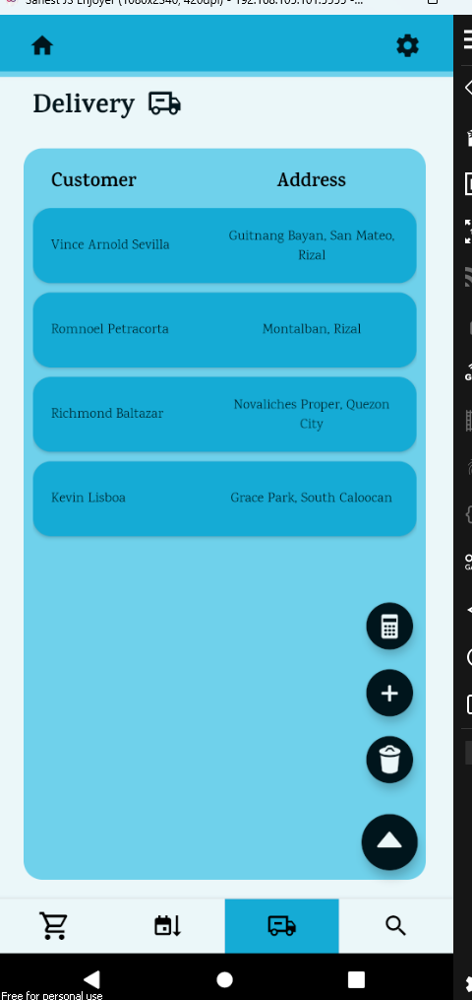
  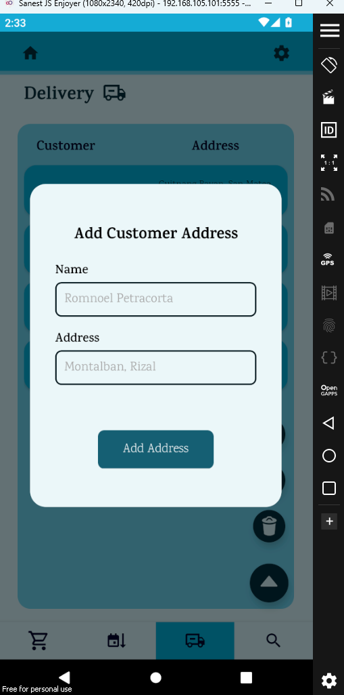
  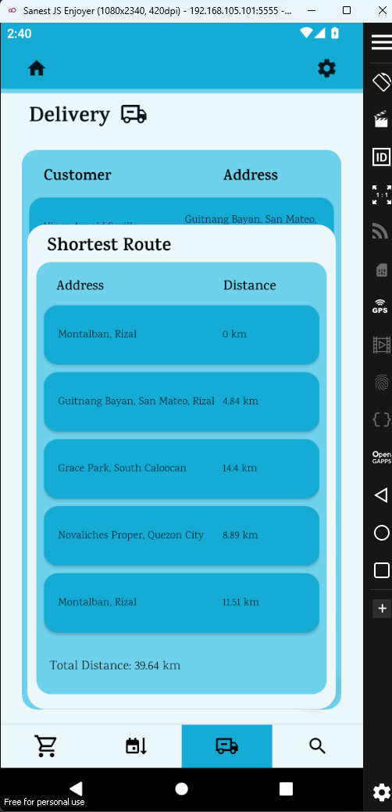

𝙵𝚒𝚗𝚊𝚕𝚕𝚢, 𝚝𝚑𝚎 <strong>𝚆𝚘𝚛𝚍 𝙵𝚒𝚗𝚍𝚎𝚛</strong>. 𝚃𝚑𝚒𝚜 𝚜𝚎𝚌𝚝𝚒𝚘𝚗 𝚠𝚒𝚕𝚕 𝚏𝚎𝚝𝚌𝚑 𝚝𝚑𝚎 𝚊𝚍𝚍𝚛𝚎𝚜𝚜𝚎𝚜 𝚒𝚗𝚜𝚒𝚍𝚎 𝚝𝚑𝚎 𝚍𝚎𝚕𝚒𝚟𝚎𝚛𝚢 𝚜𝚌𝚛𝚎𝚎𝚗, 𝚊𝚗𝚍 𝚠𝚒𝚕𝚕 𝚝𝚑𝚎𝚗 𝚙𝚎𝚛𝚏𝚘𝚛𝚖 𝚘𝚙𝚎𝚛𝚊𝚝𝚒𝚘𝚗𝚜 𝚋𝚊𝚜𝚎𝚍 𝚘𝚗 𝚝𝚑𝚎 𝚜𝚎𝚕𝚎𝚌𝚝𝚎𝚍 𝚊𝚍𝚍𝚛𝚎𝚜𝚜. 𝚄𝚙𝚘𝚗 𝚌𝚕𝚒𝚌𝚔𝚒𝚗𝚐 𝚘𝚗 𝚝𝚑𝚎 𝚊𝚍𝚍𝚛𝚎𝚜𝚜, 𝚒𝚝 𝚠𝚒𝚕𝚕 𝚝𝚑𝚎𝚗 𝚜𝚑𝚘𝚠 𝚊 𝚖𝚘𝚍𝚊𝚕 𝚝𝚑𝚊𝚝 𝚠𝚒𝚕𝚕 𝚙𝚛𝚘𝚖𝚙𝚝 𝚝𝚑𝚎 𝚞𝚜𝚎𝚛 𝚝𝚘 𝚏𝚒𝚗𝚍 𝚝𝚑𝚎 𝚠𝚘𝚛𝚍 𝚝𝚑𝚊𝚝 𝚝𝚑𝚎𝚢 𝚠𝚊𝚗𝚝, 𝚊𝚗𝚍 𝚠𝚒𝚕𝚕 𝚝𝚑𝚎𝚗 𝚞𝚜𝚎 𝚝𝚑𝚎 <strong>𝙱𝚛𝚞𝚝𝚎 𝙵𝚘𝚛𝚌𝚎 𝙰𝚕𝚐𝚘𝚛𝚒𝚝𝚑𝚖</𝚜𝚝𝚛𝚘𝚗𝚐> 𝚝𝚘 𝚏𝚒𝚗𝚍 𝚝𝚑𝚎 𝚠𝚘𝚛𝚍 𝚠𝚒𝚝𝚑𝚒𝚗 𝚝𝚑𝚎 𝚜𝚝𝚛𝚒𝚗𝚐. 𝚒.𝚎 𝚊𝚍𝚍𝚛𝚎𝚜𝚜.

  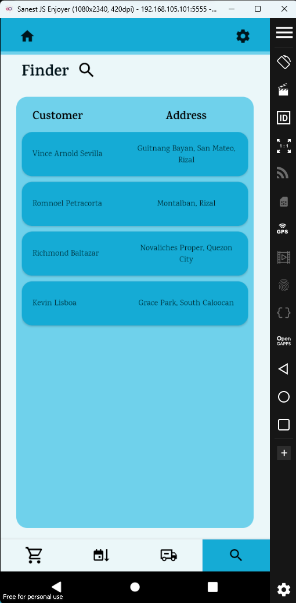
  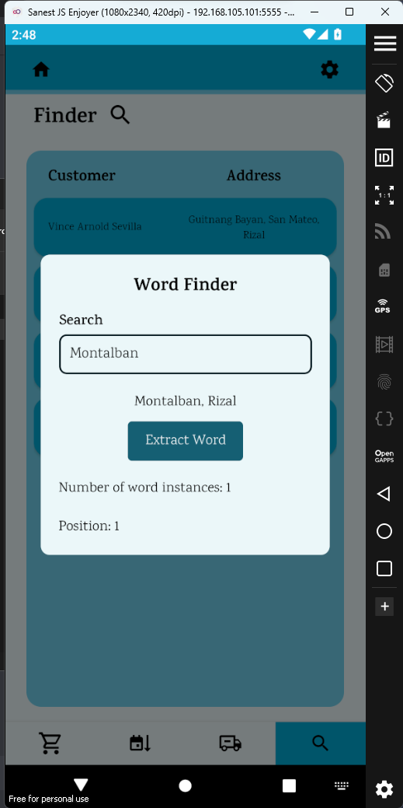

## 𝙿𝚛𝚘𝚓𝚎𝚌𝚝 𝙼𝚎𝚖𝚋𝚎𝚛𝚜

**𝙱𝚊𝚕𝚝𝚊𝚣𝚊𝚛, 𝚁𝚒𝚌𝚑𝚖𝚘𝚗𝚍**
  
  - **𝙿𝚘𝚜𝚒𝚝𝚒𝚘𝚗:** 𝙻𝚎𝚊𝚍 𝙿𝚛𝚘𝚐𝚛𝚊𝚖𝚖𝚎𝚛
  - **𝙻𝚊𝚗𝚐𝚞𝚊𝚐𝚎𝚜:** 𝙹𝚊𝚟𝚊𝚂𝚌𝚛𝚒𝚙𝚝, 𝚃𝚢𝚙𝚎𝚂𝚌𝚛𝚒𝚙𝚝
  
**𝙿𝚎𝚝𝚛𝚊𝚌𝚘𝚛𝚝𝚊, 𝚁𝚘𝚖𝚗𝚘𝚎𝚕**
  - **𝙿𝚘𝚜𝚒𝚝𝚒𝚘𝚗:** 𝚄𝙸/𝚄𝚇 𝙳𝚎𝚜𝚒𝚐𝚗𝚎𝚛/𝙿𝚛𝚘𝚐𝚛𝚊𝚖𝚖𝚎𝚛
  - **𝙻𝚊𝚗𝚐𝚞𝚊𝚐𝚎𝚜:** 𝙿𝚢𝚝𝚑𝚘𝚗, 𝙲#

**𝙻𝚒𝚜𝚋𝚘𝚊, 𝙺𝚎𝚟𝚒𝚗 𝚁𝚘𝚜**
  - **𝙿𝚘𝚜𝚒𝚝𝚒𝚘𝚗:** 𝙿𝚛𝚘𝚐𝚛𝚊𝚖𝚖𝚎𝚛
  - **𝙻𝚊𝚗𝚐𝚞𝚊𝚐𝚎𝚜:** 𝙹𝚊𝚟𝚊

**𝚂𝚎𝚟𝚒𝚕𝚕𝚊, 𝚅𝚒𝚗𝚌𝚎**
  - **𝙿𝚘𝚜𝚒𝚝𝚒𝚘𝚗:** 𝙿𝚛𝚘𝚐𝚛𝚊𝚖𝚖𝚎𝚛
  - **𝙻𝚊𝚗𝚐𝚞𝚊𝚐𝚎𝚜:** 𝙹𝚊𝚟𝚊
